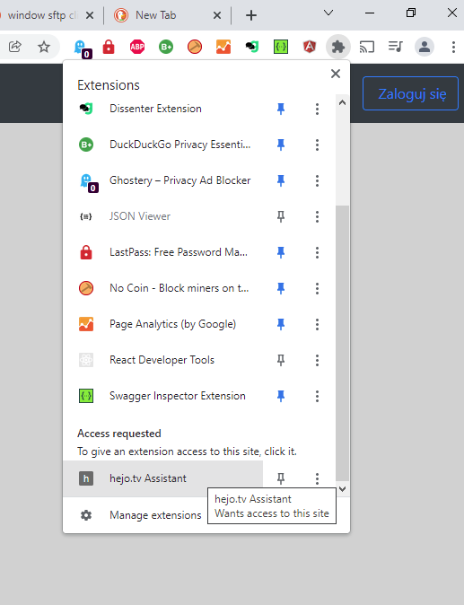

# hejo.tv Assistant

## English

This is an Google Chrome / Chromium extension that automatically removes elements of the website that cause performance issues for a Raspberry Pi, specifically a referral link at the top of the page when logged in.

To use this from its source, open the [extensions manager](chrome://extensions/) and enable Developer Mode on the top right. Then click "Load unpacked" and select the 'src' directory. You may also be required to allow the extension to run after installation and the first time you visit the site by clicking on it in the extensions list:

## Polskie

Jest to rozszerzenie Google Chrome / Chromium, które automatycznie usuwa elementy witryny, które powodują problemy z wydajnością Raspberry Pi, w szczególności link polecający u góry strony po zalogowaniu.

